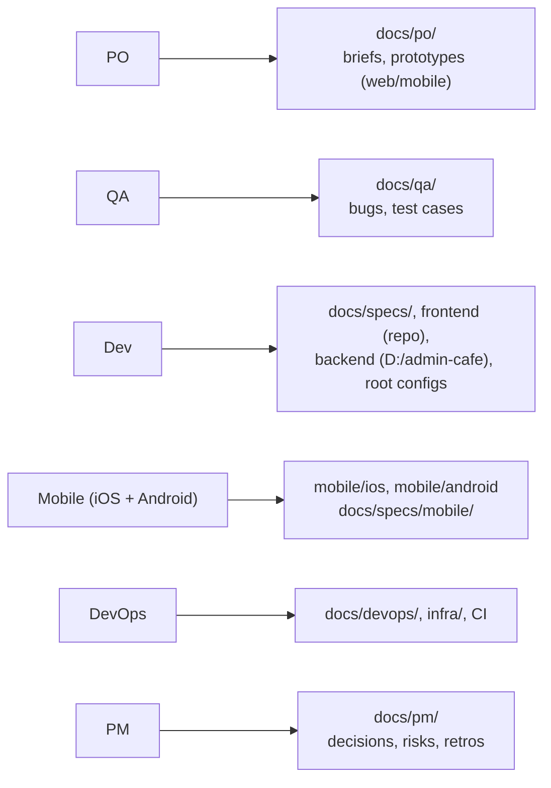
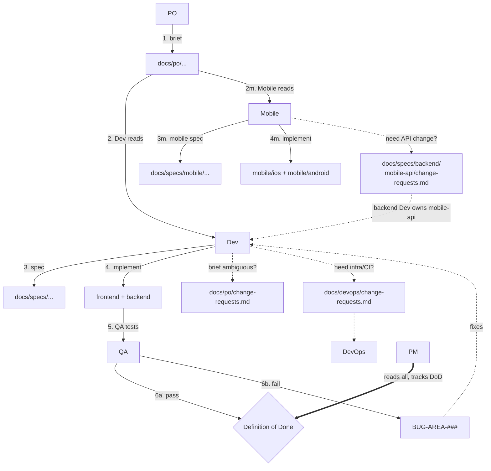

# Roles & Flows — Brewmaster

Visual guide to who owns what and how work flows. See `CLAUDE.md` for the rules.

## Ownership map

## Feature + cross-role asks

Solid = forward flow. Dotted = ask another role (never edit their folder — file
a change-request).

## Chat ↔ docs boundary

| Use chat for | Use docs for |
| --- | --- |
| "Is it deployed yet?" | the deploy log / a postmortem if it broke |
| "KHQR flaky again?" | if real, a bug (PAYMENT/MOBILE area) |
| "add one field?" quick ask | a CR in `mobile-api/change-requests.md` |
| "Postgres 16 or 17?" | the decision in `docs/pm/decisions.md` |

**Promotion rule:** when a thread reaches a conclusion, write it to the matching
doc before the thread dies. 6-month test: if a new joiner couldn't find it, it
doesn't belong only in chat.

## I need to… → go here

| I need to… | Go to |
| --- | --- |
| write/clarify a feature brief | `docs/po/` (PO) — Dev asks via `docs/po/change-requests.md` |
| write a technical spec | `docs/specs/` (Dev) |
| ask backend for an API change | `docs/specs/backend/mobile-api/change-requests.md` |
| file a bug | `docs/qa/bugs/BUG-<AREA>-<###>.md` |
| record a decision | `docs/pm/decisions.md` |
| request infra/CI/deploy | `docs/devops/change-requests.md` |
